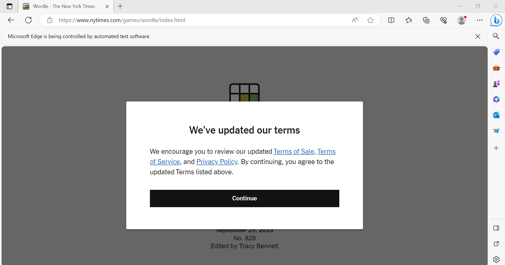
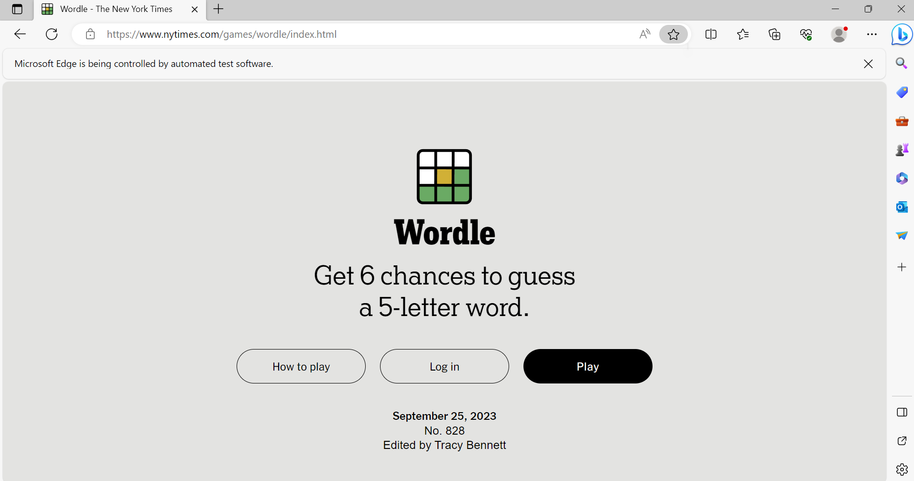

# Wordle Bot

This is a Python program that will attempt to complete the Wordle of the day when run. It will also remember words
that it has used before and serve as a database for Wordles that it has completed.

## Description

The program works by putting together random letters until it comes up with a word the the game will accept.
Once it does, it will move on to the next guess and it will also put the word that it guessed into a file
for later use. It can use these words on the 2nd, 3rd and 4th guesses if they fit in with the Wordle hints.
Right now, the bot uses completely random letters, but I am planning on making it so that it can learn from 
the words that it has already guessed to maybe help it make certain letters more common.

## Getting Started

### Dependencies

* Selenium
* WebDriverManager
* Windows 10
	* Edge driver works in Windows 10 but chrome driver does not at the moment.
	*I have gotten chrome driver to work in linux but not edge.
* Google Chrome, Firefox, or Microsoft Edge

### Installing

* You can download the code from this repository and make sure you have the Wordles.txt file and Words.txt file, as 
the code uses them.
* If you would like to have all of the learned words and World history that the bot has, leave the text files as is. If you
would like to start from scratch, delete the contents of the text files.

### Executing program

* When you run the program, it will ask you if you would like to play or look at history.
* If you would like the bot to play, type "play".
* If you would like to look at history, type "history" and enter a date.
* Once you type "play", if the bot has already played today, it will ask you if you would like to redo the Wordle.
	* If you want to redo the Wordle, the program will delete the data from the day's Wordle and go again.
	* If you do not, the Wordlebot will close with no changes.
* If the bot has not done the Wordle of the day, the program will open the browser that you chose and start playing.
* The WordleBot will start from either of the following two screens:
	* 
	* 
* If the browser starts with a different screen (such as a cookie pop up), you can change the flag self.start_wait to true on line 96
to give you time to click through.

## Help

If you cannot get the program to work with any of the provided browsers, you can go here: https://pypi.org/project/webdriver-manager/
to get support, or figure out how to try other browsers. If you would like more information on Selenium, please visit this site:
https://selenium-python.readthedocs.io/index.html.